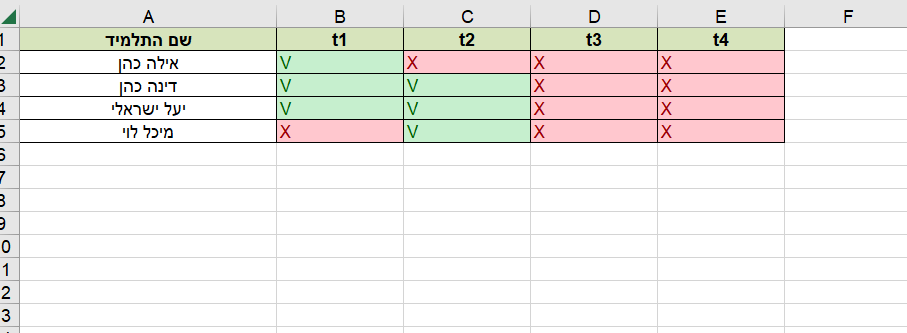

# 📚 Homework Checker System

---

## 🚀 Overview
A smart Python automation tool designed to help teachers automatically verify Java homework submissions across multiple student directories and generate a structured Excel report.

This system eliminates manual checking and significantly improves grading efficiency.

---

## 🎯 Problem It Solves
Teachers often waste time manually searching for student submissions across multiple folders.

This tool automates the entire process:
- Navigates through all student directories
- Checks if the required Java file exists
- Generates a clean Excel report with results

---

## ⚙️ How It Works
1. Teacher enters the exercise name to check  
2. The system scans all student folders  
3. For each student:
   - Searches for a `.java` file matching the exercise name  
4. Generates an Excel report:
   - ✔ File exists  
   - ✖ File missing  

The Excel file is automatically updated each run (no duplicates, always refreshed).

---

## 🔄 System Flow
Teacher Input → Folder Scanner → File Validator → Result Generator → Excel Output

---

## 📁 Project Structure
homework-checker/
│
├── main.py # Main execution file
├── src/ # Core logic modules
├── requirements.txt # Dependencies
├── .gitignore
├── README.md
└── excel-output.png # Output screenshot

---

## 📸 Output Screenshot

The Excel report is automatically generated and updated after each run, ensuring clean and up-to-date results without duplication.

---

## 📊 Output Example
| Student Name | Exercise_1 |
| ------------ | ---------- |
| David        | ✔          |
| Sarah        | ✖          |
| Noa          | ✔          |

---

## 🛠️ Technologies Used
- Python 🐍  
- os / pathlib (file system traversal)  
- Excel automation (openpyxl / pandas)  
- Data processing & automation logic  

---

## 💡 Key Features
- 🔍 Automatic directory scanning  
- 📂 Multi-student support  
- ☕ Java file validation  
- 📊 Excel report generation  
- 🔄 Clean overwrite of previous results  
- ⚡ Fast and scalable automation  

---

## 🔮 Future Improvements
- Graphical User Interface (GUI) for teachers  
- Multi-language assignment support (Java, Python, C#)  
- Web dashboard for centralized grading  
- Cloud storage integration  
- Automated submission upload system  

---

## ⭐ About This Project
This project was built as a real-world automation tool to reduce manual workload for teachers and improve grading efficiency.

It demonstrates practical skills in:
- File system automation  
- Data processing pipelines  
- Real-world Python application design  
- Structured reporting using Excel  

---

## 👩‍💻 Author
Developed by **Chana Winfeld**  
Software Engineering Student | Full Stack Developer  

---

## ⭐ Why This Project Matters
This project shows:
- Strong problem-solving ability  
- Real-world automation thinking  
- Clean and scalable code structure  
- Practical engineering mindset  

Perfect for academic and professional portfolio 🚀